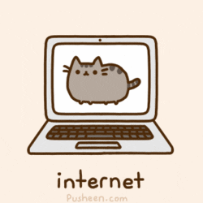
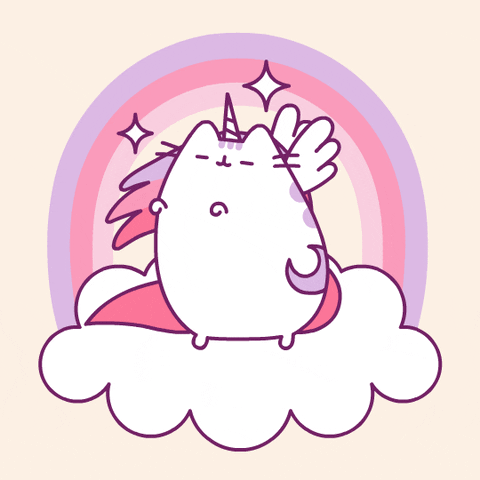

# Hey 👋, This is Sarah Hoffman. 
# I am a training in the basics to become a full-stack web developer!

## I'm currently attending the TTS Full-Stack Web Developer [Bootcamp](https://codeshv.com/), which will be completed in March 2021.

- 🔭 I’m currently working on this wonderful intracacies of this self readme and maybe a bit more work on my Java Calculator...
- 🌱 I’m currently learning Java: OOP 3 - Interfaces, Method Overriding next week.
- 👯 I’m looking to collaborate on future projects with my fellow students.
- 🤔 I’m looking for help with ...
- 😄 Pronouns: She/Her
- ⚡ Fun fact:

  

# ⚡ Technologies

## Now I am not claiming to be stupendously proficient in the below tech. However, I am still in the middle of studying and learning the basics.
## With alot more practice and training who knows where I'll be in the future?? Maybe building some otome game for an app on Android devices.
## I could write a dictionary for coding beginners or even test games and write code for front end game development.

# Some of my Github Stats

  

# About Me Section: Personal not Pro

Things I Enjoy: | Things that I'm allergic to:
--------------------------------------------------------------------------------------------------|-----------------------------------------------------------------------------------
Reading Manga & Web Novels | Everything except mold.
Older console RPG, Puzzle, Strategy Games | Cat/Animal Saliva
Fluffy/Velvety/Soft/Cute Things | Dairy

### Some games that I enjoy playing are older console/pc games like Legend of Mana, Suikoden 3, Saga Frontier 2, Wild Arms series, Early Ps1-Ps3 console Tales series, Diablo/Starcraft/Warcraft, King's Quest series, Total Annihilation, Mech Warrior.

### Handhelds Im playing or want to play at the moment:

### Story of Seasons, Animal Crossing, Zelda: Breath of the Wild, and I'm looking forward to playing Rune Factory 5 & the new Story of Seasons:POOT and the Harvest Moon: One World....

### SOS and HM both have their weak points and strengths. SOS is better game mechanics and overall play styles and well the character sprites in Harvest Moon look better. 

### I will say Rune Factory has the best of both worlds art, music, game, mechanics. I enjoyed playing the whole series.

### I really enjoying playing otome games as well as pc games such as Ark Survival Evolved, Wurm Unlimited, Wurm Online, Eve Online, 7 Days to Die, etc. <---These are just the ones I spend the most time playing, when I have free time.
 

## *Placeholder for resume Link*

## *Placeholder for professional About me Section*

# _**Goals for the near Future**_

### I want to graduate this class with great grades and gain more confidence in myself to interact with people again. I'm a pretty laid back chill person. I try to get things done in a timely manner and am organized. I'm a bit OCD and I get anxious around people at first but once I know who you are I can get along great with "most" people. I've grown up around tech most of my life. My dad is a computer engineer he can do most things through hands on experience and after I finish this course I plan on "apprenticing" to him so that I can gain some of his knowledge and get into a new mind set for the future.

